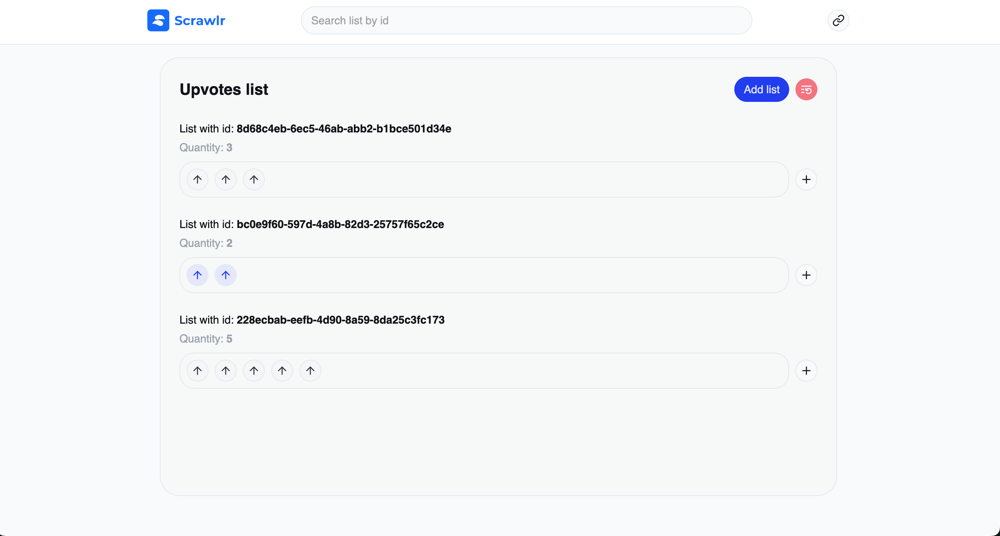
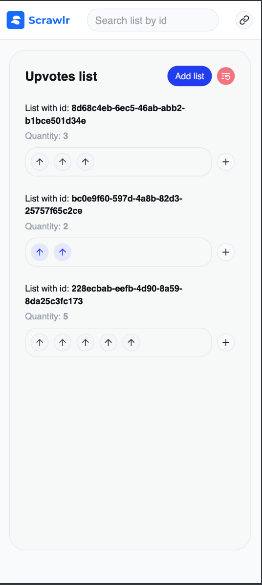

<div align="center">
  
</div>

<br/>
<br/>

## 📋 Table of Contents

- [🎯 About](#about)
- [🚀 Features](#features)
- [📋 Prerequisites](#prerequisites)
- [🛠️ Installation](#installation)
  - [Option 1: Local Development](#option-1-local-development)
  - [Option 2: GitHub Codespaces](#option-2-github-codespaces)
- [🧪 Testing](#testing)
- [📚 Development Roadmap](#development-roadmap)
  - [🚀 Chosen Technologies](#chosen-technologies)
  - [⌛ Timeline](#timeline)
  - [Conclusion](#conclusion)

## About

Create a React upvote system where each list works independently - clicking any upvote toggles the ENTIRE list.

"+" button adds new upvotes that inherit the list's current state.

Use Context + useReducer, persist in localStorage, specific colors:
- Default background color #F4F6F8 with arrow #343A40 
- Selected background color #E5E8FD with arrow #253CF2

Reusable components.

🎯 Essence: Grouped upvote lists + persistence + tests.

<div align="center">


</div>

## Features

- Modern and responsive UI with Tailwind CSS
- Type-safe development with TypeScript
- Fast development experience with Vite
- State management with React Context and Reducer
- Comprehensive testing with Vitest
- Code quality tools with Biome

## Prerequisites

- Node.js (v18 or higher)
- pnpm (recommended), npm, or yarn

## Installation

### Option 1: Local Development

1. Clone the repository:
```bash
git clone https://github.com/m7ez1n/scrawlr-challenge
cd scrawlr
```

2. Install dependencies:
```bash
# Recommended
pnpm install

# Alternative
npm install
# or
yarn install
```

3. Start the development server:
```bash
# Recommended
pnpm dev

# Alternative
npm run dev
# or
yarn dev
```

The application will be available at `http://localhost:5173`

### Option 2: GitHub Codespaces

1. **Open in Codespaces:**
   - Go to the repository on GitHub
   - Click the green "Code" button
   - Select "Codespaces" tab
   - Click "Create codespace on main"

2. **Wait for Setup:**
   - The devcontainer will automatically:
     - Install Node.js LTS
     - Install PNPM globally
     - Install project dependencies
     - Configure VS Code extensions (Biome, Tailwind, TypeScript)

3. **Start Development:**
   ```bash
   pnpm dev
   ```

4. **Access the App:**
   - Codespaces will automatically forward port 5173
   - Click on the "Open in Browser" notification or
   - Go to the "Ports" tab in VS Code and click the globe icon

**Benefits of Codespaces:**
- ✅ No local setup required
- ✅ Pre-configured development environment
- ✅ Consistent environment across team members
- ✅ Automatic dependency installation
- ✅ Built-in code formatting with Biome

## Testing

Run the test suite:
```bash
# Recommended
pnpm test

# Alternative
npm run test
# or
yarn test
```

## Development Roadmap

### Chosen Technologies

- [React with Vite](https://vitejs.dev/guide/) 
  - Extremely fast build tool with optimized HMR (Hot Module Replacement)
  - Zero-config for TypeScript, JSX, CSS and more
  - Optimized bundle size with Rollup
  - Native ESM (ECMAScript Modules) support
  - Excellent DX (Developer Experience) with instant feedback

- [TypeScript](https://www.typescriptlang.org/)
  - Static type system that prevents runtime errors
  - Better autocompletion and IntelliSense
  - Interfaces and types that document the code
  - Facilitates refactoring and maintenance

- [Tailwind CSS](https://tailwindcss.com/) 
  - Utility-first approach that eliminates the need to name classes
  - Simplified responsive design
  - Centralized configuration for customization

- [Lucide React](https://lucide.dev/)
  - Optimized SVG icon library
  - Customization via props (size, color, stroke)
  - Tree-shakeable (only imports used icons)
  - Visual consistency throughout the application

- [Biome](https://biomejs.dev/)
  - Linter, formatter and bundler in a single tool
  - Superior performance to ESLint + Prettier
  - Zero configuration required
  - Native TypeScript support
  - Optimized linting rules for React

- [Vitest](https://vitest.dev/) 
  - Compatible with Jest but much faster
  - Native TypeScript and ESM support
  - Interactive UI for testing
  - Intelligent watch mode
  - Perfect integration with Vite

- [React Context and Reducer](https://react.dev/learn/scaling-up-with-reducer-and-context)
 - Native React state management
   - Zero dependencies, smaller bundle, demonstrates React fundamentals over library dependency
  - State Reducer pattern for maximum flexibility 
    - Pure functions easier to test, allows behavior customization, better debugging with React DevTools
  - Avoids prop drilling 
    - Clean data flow, centralized state for all upvote lists without passing props through layers
  - Easy to test and maintain 
    - Pure reducers are straightforward to unit test, standard React patterns any developer understands
  - Clear separation between state logic and UI
    - Business logic isolated in reducers, components focus on presentation
  - Right tool for the scope 
    - Avoids over-engineering a simple system, shows technical maturity in tool selection

### Timeline 

#### Beginning
1. Understanding project scope and requirements
2. Defining technologies and architecture

#### Middle 
1. Creation and configuration of a base UI
2. Creation of context and reducer logic to implement all project requirements
3. Adding components that would be common across the application
4. Adjusting the UI for a more modern and responsive design with new features
5. Adding new functionalities to the reducer (search and reset)

#### End 
1. Creating component and store tests
2. Documentation of what was done
3. **CI/CD Setup**: Created GitHub Actions workflow (`.github/workflows/pr-validation.yml`) for automated PR validation including linting, type checking, and testing
4. **Development Environment**: Configured Github Codespace (`.devcontainer/devcontainer.json`) with pre-installed extensions and settings for consistent development experience

### Conclusion 

This was a very interesting project! I was able to review and practice unit testing, which I hadn't been working with for a while. The best part was being able to make technical decisions, choosing the right tools without causing over-engineering, keeping the code simple but ready to grow.